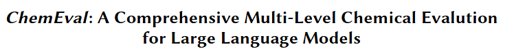
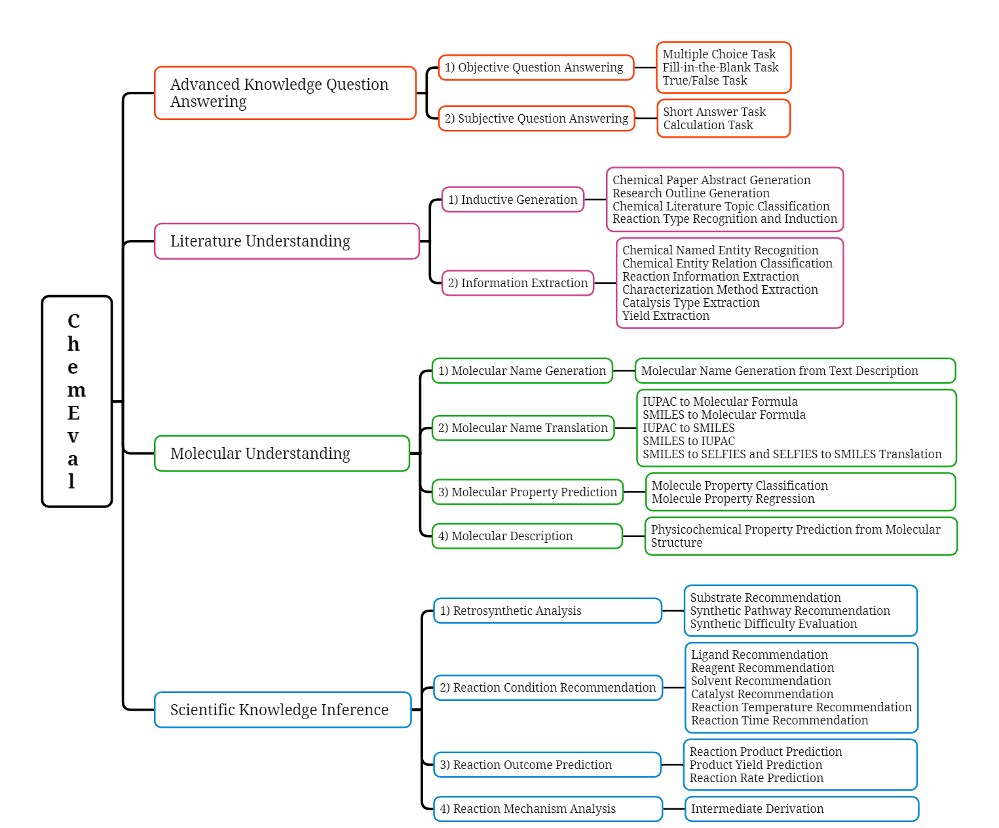
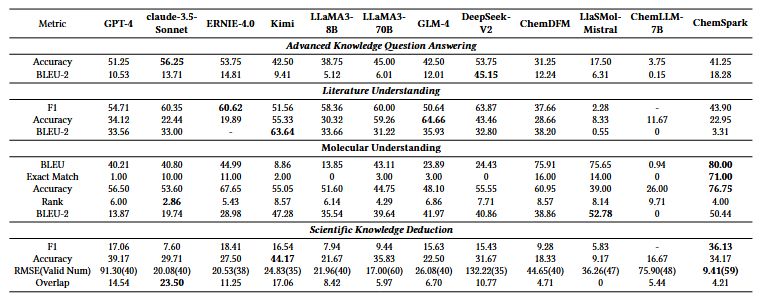
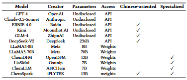
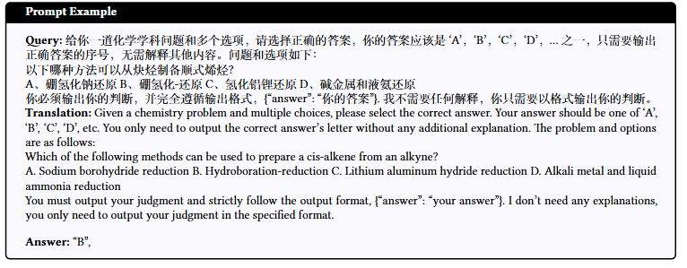
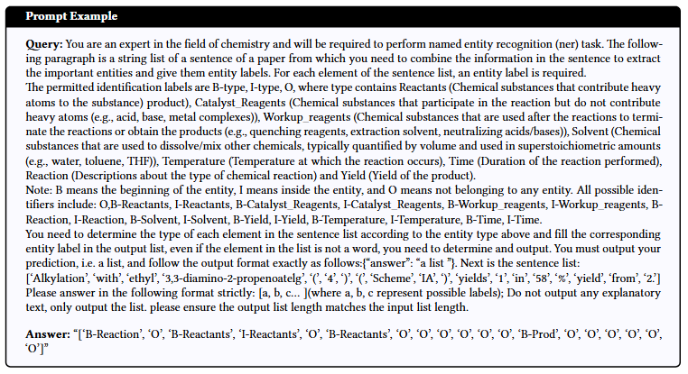
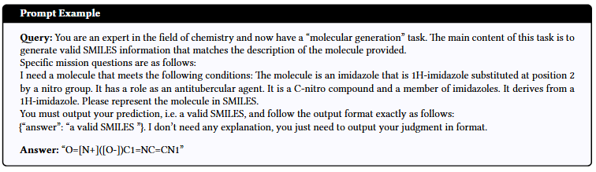
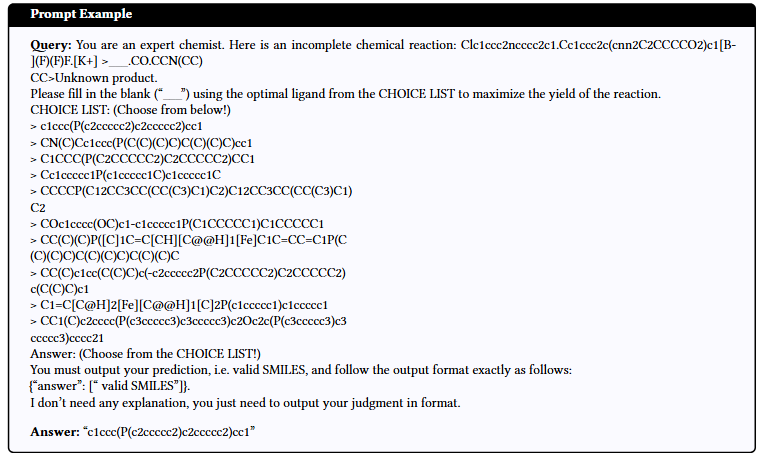

**ChemEval** is specifically designed to evaluate the capabilities of LLMs within the chemical domain, whcich encompass 4 levels, 12 dimensions, and a total of 42 distinct tasks, covering a vast array of issues within the domain of chemical research. Please check our paper for more details.

We hope ChemEval will facilitate the application of large language models in the field of chemistry research.



## Table of Contents

- [Results](#results)
- [Experiment Setting](#experiment-setting)
- [Data](#data)
- [TODO](#todo)

## Results

Below are the results of models in 0-shot learning in our experiment setting. In summary, general LLMs excel in basic knowledge tasks due to their extensive pre-training, while specialized chemical LLMs outperform in chemical expertise tasks, highlighting the value of domain-specific training. However, specialized LLMs face challenges in instruction fine-tuning and suffer from catastrophic forgetting, affecting their foundational NLP capabilities. Few-shot prompting improves text processing for some models but not for others, particularly those with specialized chemical knowledge. Lastly, model scaling positively impacts performance, with larger models like LlaMA3-70B showing better comprehension and reasoning abilities in complex chemical tasks.



## Experiment Setting

### Models



We assesses the chemical prowess of LLMs, including major general models and some chemically fine-tuned ones. GPT-4 from OpenAI is a top performer, while Anthropic's Claude-3.5 is noted for surpassing GPT-4. Claude-3.5-Sonnet sets new benchmarks. Baidu's ERNIE and Moonshot AI's Kimi are advanced content creation tools. Meta AI's LLaMA is a leading open-weight model, with LLaMA3-8B and LLaMA3-70B evaluated here. ZhipuAI's GLM-4 outperforms LLaMA3-8B, and DeepSeek's DeepSeek-V2 is a robust MoE model comparable to GPT-4-turbo.

Specialized LLMs like ChemDFM, based on LLaMA-13B, excel in chemical tasks, outperforming GPT-4. LlaSMol, with Mistral as its base, significantly outperforms Claude-3.5-Sonnet in chemistry. ChemLLM by AI4Chem predicts chemical properties and reactions, while ChemSpark is trained on a mixed dataset of general and chemical Q&A.

### Metric

We utilize a range of evaluation metrics to comprehensively assess our models' performance across diverse tasks. For the majority of tasks, we utilize the F1 score and Accuracy. In addition, we utilize BLEU, Exact Match, RMSE(Valid Num), Rank and Overlap in different tasks to meet the needs of different tasks. It is worth noting that Valid Num refers to the number of valid outputs by models and the value of RMSE is obtained through the weighted average of valid output. For some tasks with short answers, we only use 2-gram BLEU to evaluate the answers. For specific tasks like synthetic pathway recommendation, our evaluation combines automated metrics with expert manual review to ensure accuracy and professional insight. This framework ensures a detailed and effective evaluation of model performance across different settings.

## Data

Example of question in Advanced Knowledge Questions:



Example of question in Chemical Literature Comprehension:



Example of question in Molecular Understanding:



Example of question in Scientific Knowledge Deduction:



## TODO

- [ ] incorporation of multimodal tasks

- [ ] add results of more API-based models

## Licenses

[](http://creativecommons.org/licenses/by-nc-sa/4.0/)

The ChemEval dataset is licensed under a [Creative Commons Attribution-NonCommercial-ShareAlike 4.0 International License](http://creativecommons.org/licenses/by-nc-sa/4.0/)

## Citation

Please cite our paper if you use our dataset.

```
@article{ChemEval,
title={}, 
author={}
journal={},
year={}
}
```