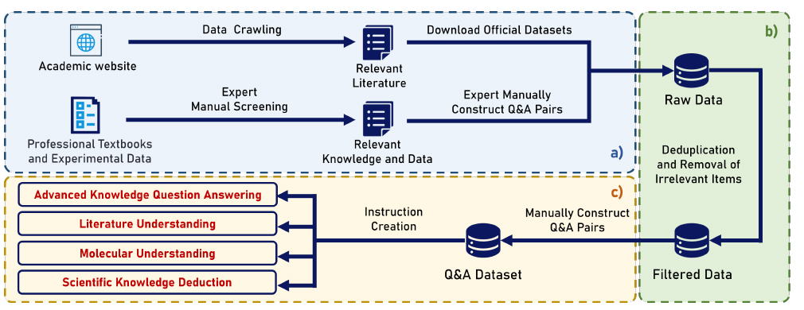
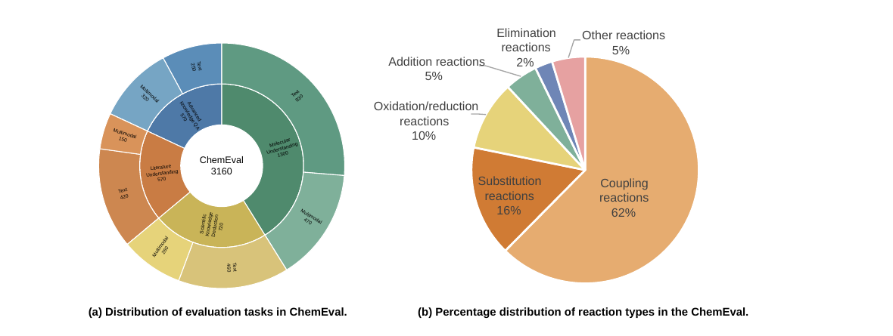
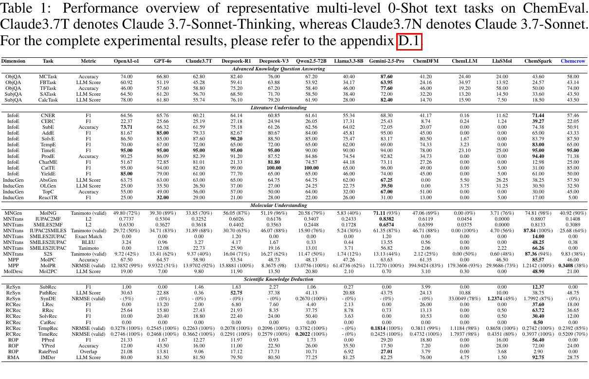
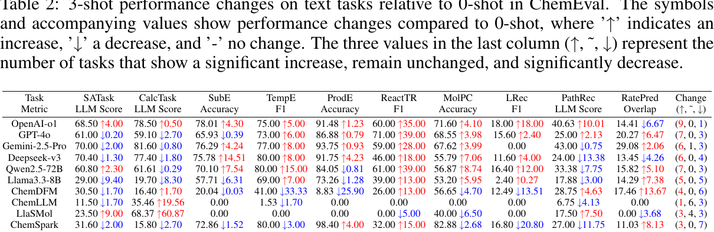
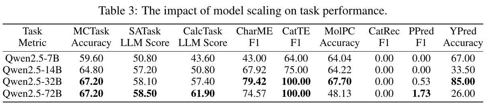
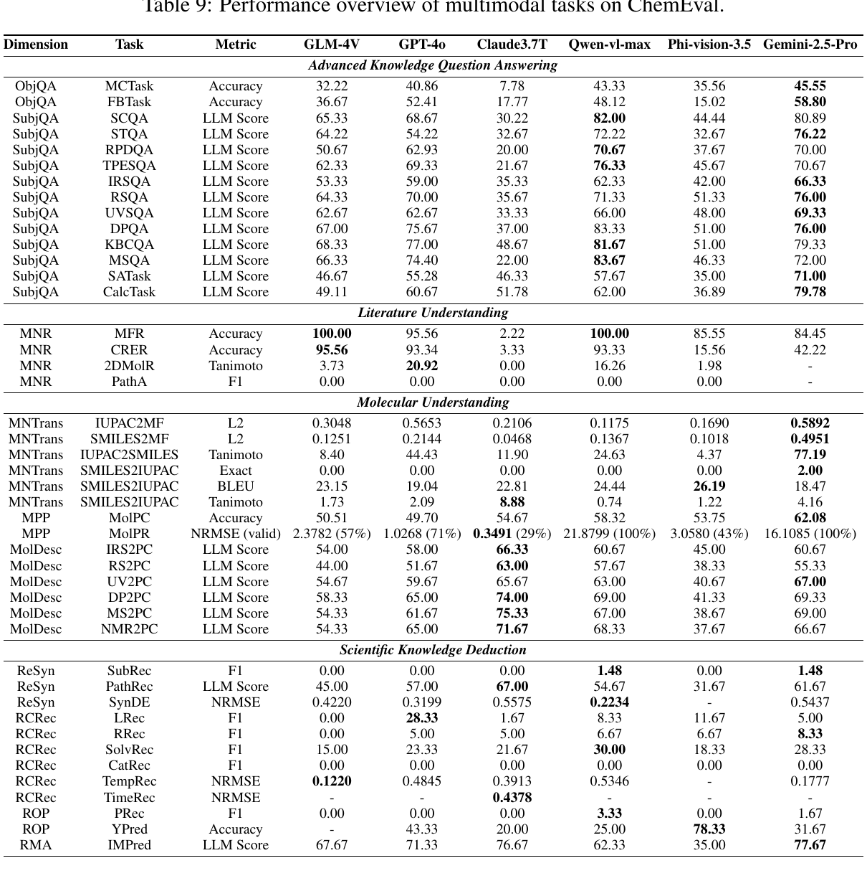

# ChemEval: Multi-Level Chemical Capability Evaluation

[](https://openreview.net/forum?id=JrqjSkEPrX)
[](https://openreview.net/forum?id=JrqjSkEPrX)
[](https://arxiv.org/abs/2409.13989)
[](https://huggingface.co/datasets/Ooo1/ChemEval)
[](http://creativecommons.org/licenses/by-nc-sa/4.0/)

Official repository for **ChemEval: A Multi-level and Fine-grained Chemical Capability Evaluation for Large Language Models**, published as an **ICLR 2026** conference paper.

ChemEval is a fine-grained benchmark for evaluating large language models and multimodal large language models in chemistry. It organizes chemical capability assessment into **4 progressive levels**, **13 capability dimensions**, and **62 textual and multimodal tasks**, spanning textbook-level chemical knowledge, literature understanding, molecular understanding, and scientific knowledge deduction.

**Authors:** Yuqing Huang*, Rongyang Zhang*, Xuesong He, Xuyang Zhi, Hao Wang, Nuo Chen, Zongbo Liu, Xin Li, Feiyang Xu, Deguang Liu, Huadong Liang, Yi Li, Jian Cui, Yin Xu, Shijin Wang, Qi Liu, Defu Lian, Guiquan Liu, Enhong Chen.

**Affiliations:** University of Science and Technology of China; iFLYTEK Co., Ltd.  
`*` Equal contribution. The paper marks Hao Wang, Xin Li, Guiquan Liu, and Enhong Chen as corresponding authors.

**Links:** [Paper](https://openreview.net/forum?id=JrqjSkEPrX) | [PDF](https://openreview.net/pdf?id=JrqjSkEPrX) | [arXiv](https://arxiv.org/abs/2409.13989) | [Dataset](https://huggingface.co/datasets/Ooo1/ChemEval) | [Project Page](https://ustc-starteam.github.io/ChemEval/) | [Citation](#citation)

<p align="center">
  
</p>

## Highlights

- **Multi-level chemical evaluation:** ChemEval progresses from advanced knowledge question answering to literature understanding, molecular understanding, and scientific knowledge deduction.
- **Textual and multimodal coverage:** The benchmark includes text-only tasks as well as chemistry-related visual inputs such as molecular structure diagrams, statistical charts, tables, reaction profiles, and spectra.
- **Fine-grained capability dimensions:** 13 dimensions probe objective and subjective QA, information extraction, inductive generation, molecular name recognition, property prediction, retrosynthesis, reaction condition recommendation, outcome prediction, and mechanism analysis.
- **Expert-validated construction:** The benchmark combines curated open-source datasets with expert-authored and expert-validated materials, including in-house tasks designed for practical chemical research scenarios.
- **Reproducible evaluation scripts:** This repository provides pipelines for model-response extraction, LLM-based grading, and code-based metric computation for textual and multimodal ChemEval tasks.

## Benchmark At A Glance

| Level | Capability dimensions | Tasks | What it probes |
| --- | --- | ---: | --- |
| Advanced Knowledge Question Answering | Objective Questions, Subjective Questions | 15 | Chemical terminology, core concepts, quantitative analysis, and chemistry QA. |
| Literature Understanding | Inductive Generation, Information Extraction, Molecular Name Recognition | 19 | Reading chemical literature, extracting structured facts, recognizing formulas/equations/structures, and generating research summaries or outlines. |
| Molecular Understanding | Molecular Name Generation, Molecular Name Translation, Molecular Property Prediction, Molecular Description | 15 | SMILES/IUPAC conversion, structure interpretation, molecular properties, and molecular description from text or visual evidence. |
| Scientific Knowledge Deduction | Retrosynthetic Analysis, Reaction Condition Recommendation, Reaction Outcome Prediction, Reaction Mechanism Analysis | 13 | Synthesis planning, reaction condition selection, product/yield prediction, and mechanism reasoning. |

The ICLR 2026 version reports **1,960 text examples** and **1,200 multimodal examples**. Across the 62 task categories, the paper describes 25 adapted open-source tasks and 37 in-house tasks developed with domain experts.

<p align="center">
  
</p>

## Key Findings

The paper reports that general-purpose LLMs are strong at literature understanding and instruction following, but struggle on tasks requiring deep molecular understanding and scientific inference. Chemistry-specialized LLMs perform better on technical chemistry tasks, especially terminology and molecular property tasks, but can show weaker general language ability and instruction following.

The results also suggest that scaling, few-shot prompting, and reasoning-oriented models help in some settings, but are not sufficient by themselves for complex chemical tasks. ChemEval is intended to make these gaps measurable and to encourage tighter integration of LLMs with chemical knowledge, simulation tools, and multimodal evidence.

## Experimental Highlights

### Representative 0-Shot Text Results

<p align="center">
  
</p>

### Few-Shot Changes

<p align="center">
  
</p>

### Model Scaling

<p align="center">
  
</p>

### Multimodal Results

<p align="center">
  
</p>

## Repository Structure

```text
ChemEval/
|-- Textual/
|   |-- code evaluate/       # Rule/code-based answer extraction and metrics for text tasks
|   \-- LLM evaluate/        # LLM-based grading pipeline for text tasks
|-- Multimodel/              # Multimodal evaluation scripts; directory name kept from release
|   |-- 1_prompt_chem/       # Multimodal prompt and response preparation
|   |-- 2_LLM_evaluate/      # Multimodal LLM-based evaluation helpers
|   \-- 3_code_evaluate/     # Multimodal code-based answer extraction and metrics
|-- docs/                    # Project website for GitHub Pages
|-- requirements.txt
\-- README.md
```

## Installation

Create a Python environment and install the listed dependencies:

```bash
conda create -n chemeval python=3.10 -y
conda activate chemeval
pip install -r requirements.txt
```

Some molecular evaluation scripts use the included OPSIN jar and chemistry packages such as RDKit, SELFIES, py2opsin, and rdchiral. If RDKit installation fails through pip in your environment, install it through conda-forge first:

```bash
conda install -c conda-forge rdkit -y
```

## Data

The released ChemEval dataset is hosted on Hugging Face:

```text
https://huggingface.co/datasets/Ooo1/ChemEval
```

After downloading or preparing model responses, organize them by model and task before running the extraction and evaluation scripts. The textual code-evaluation pipeline expects model outputs under a `dataset_ntimes/` style directory:

```text
dataset_ntimes/
|-- model_1/
|   \-- model_1_nt.json
|-- model_2/
|   \-- model_2_nt.json
\-- ...
```

## Textual Evaluation

### Code-Based Metrics

1. Set `dir_path` in `Textual/code evaluate/1_Split_filename.py`, then run:

```bash
python "Textual/code evaluate/1_Split_filename.py"
```

This splits model responses into task-specific files according to the `filename` field.

2. Set `file_dir` in `Textual/code evaluate/2_Extract.py`, then run:

```bash
python "Textual/code evaluate/2_Extract.py"
```

This extracts normalized answers from model responses and writes JSON/JSONL files into a `result_ntimes/` style directory.

3. Set `root_path` in `Textual/code evaluate/3_Evaluate.py`, then run:

```bash
python "Textual/code evaluate/3_Evaluate.py"
```

This computes task metrics for extraction, recognition, classification, regression, reagent selection, reaction-rate prediction, molecular design, and related tasks.

### LLM-Based Metrics

1. Set `folder_path` and `output_file` in `Textual/LLM evaluate/1_prompt_chem.py`, then run:

```bash
python "Textual/LLM evaluate/1_prompt_chem.py"
```

2. Set `file_path` in `Textual/LLM evaluate/2_L1_task_eval.py`, then run:

```bash
python "Textual/LLM evaluate/2_L1_task_eval.py"
```

This evaluates multiple-choice, true/false, fill-in-the-blank, short-answer, and calculation tasks, with results written to Excel.

3. Set `folder_path` and `excel_path` in `Textual/LLM evaluate/3_other_task_eval.py`, then run:

```bash
python "Textual/LLM evaluate/3_other_task_eval.py"
```

This evaluates abstract writing, outlining, reaction intermediates, single-step synthesis, multi-step synthesis, and physicochemical property tasks.

## Multimodal Evaluation

The multimodal release is organized under `Multimodel/`.

1. Use `Multimodel/1_prompt_chem/` to prepare multimodal model prompts and collect model responses.
2. Use `Multimodel/2_LLM_evaluate/` to split and process LLM-based multimodal evaluation outputs.
3. Use `Multimodel/3_code_evaluate/` for code-based extraction and metrics over multimodal tasks.

The main code-evaluation entry points are:

```bash
python "Multimodel/3_code_evaluate/1Extract.py"
python "Multimodel/3_code_evaluate/2Evaluate.py"
```

Several scripts contain dataset- or experiment-specific paths from the original release. Update the path variables near each script entry point before running a new evaluation.

## Project Website

The project page is available under `docs/index.html` and is intended for GitHub Pages:

```text
https://ustc-starteam.github.io/ChemEval/
```

GitHub Pages is configured to serve this project page from the repository's `docs/` directory on the `main` branch.

## License

The ChemEval dataset and released repository materials are licensed under the [Creative Commons Attribution-NonCommercial-ShareAlike 4.0 International License](http://creativecommons.org/licenses/by-nc-sa/4.0/).

## Citation

If you find ChemEval useful, please cite the ICLR 2026 paper:

```bibtex
@inproceedings{
huang2026chemeval,
title={ChemEval: A Multi-level and Fine-grained Chemical Capability Evaluation for Large Language Models},
author={Yuqing Huang and Rongyang Zhang and Xuesong He and Xuyang Zhi and Hao Wang and Nuo Chen and Zongbo Liu and Xin Li and Feiyang Xu and Deguang Liu and Huadong Liang and Yi Li and Jian Cui and Yin Xu and Shijin Wang and Qi Liu and Defu Lian and Guiquan Liu and Enhong Chen},
booktitle={The Fourteenth International Conference on Learning Representations},
year={2026},
url={https://openreview.net/forum?id=JrqjSkEPrX}
}
```

The earlier arXiv version is available as:

```bibtex
@article{huang2024chemeval,
  title={ChemEval: A Comprehensive Multi-Level Chemical Evaluation for Large Language Models},
  author={Huang, Yuqing and Zhang, Rongyang and He, Xuesong and Zhi, Xuyang and Wang, Hao and Li, Xin and Xu, Feiyang and Liu, Deguang and Liang, Huadong and Li, Yi and others},
  journal={arXiv preprint arXiv:2409.13989},
  year={2024}
}
```
